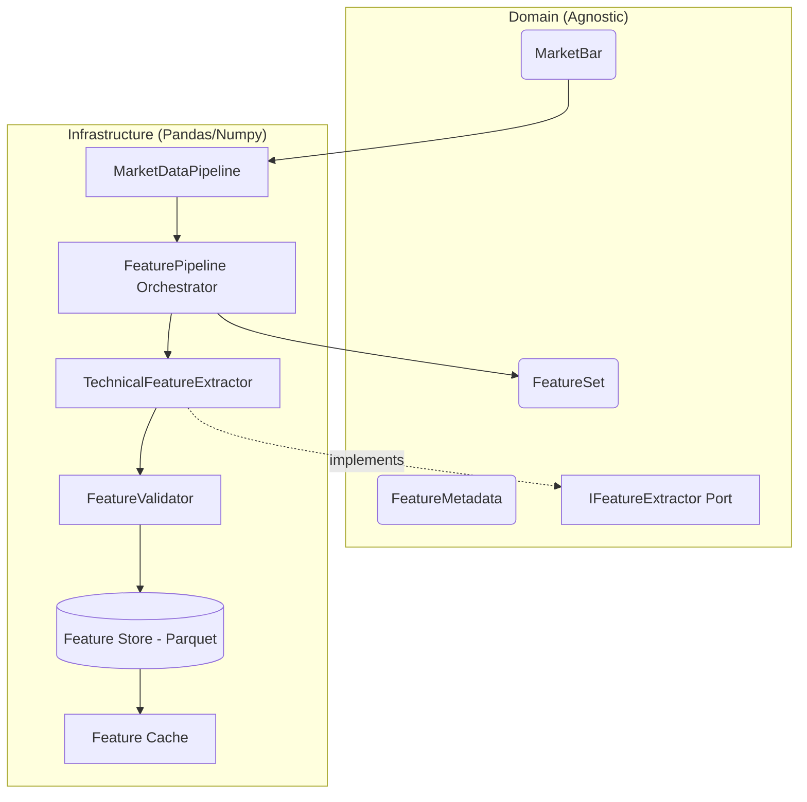

# Feature Engine (Aegis Quant OS)

## Vision & Souveraineté
Le **Feature Engine** d'Aegis Quant OS est conçu pour garantir la souveraineté totale sur la création de signaux quantitatifs.
Afin d'éviter toute "boîte noire" (comme `TA-Lib` ou `pandas-ta`) et de s'affranchir de toute adhérence prématurée à des frameworks de Machine Learning spécifiques (ex: Microsoft Qlib), les calculs sont implémentés mathématiquement "from scratch" en utilisant exclusivement **pandas** et **numpy**.

## Architecture (Hexagonale)

Le Feature Engine respecte la Clean Architecture :

### Le Domain
- Le `FeatureSet` est un objet immuable, qui ne contient que des types natifs Python (`float`, `Decimal`).
- **Aucune dépendance** à `pandas` ou `numpy` n'est tolérée dans le Domain.

### L'Infrastructure
- `TechnicalFeatureExtractor` : Convertit les `MarketBar` en `DataFrame`, calcule les indicateurs en `O(1)`, puis renvoie des `FeatureSet` propres.
- `FeatureValidator` : S'assure que les données générées ne contiennent ni `NaN` inattendus (hors période de *burn-in* de 200 barres max), ni `Inf`, ni sauts chronologiques.
- `FeatureStore` : Sauvegarde persistante des caractéristiques au format Parquet pour une lecture I/O ultra-rapide et l'ingestion massive par de futurs moteurs de Machine Learning.
- `FeaturePipeline` : Orchestrateur principal qui route le delta manquant (Market Data -> Extractor -> Store -> Cache).

## Liste des Features Implémentées (Noyau Fondamental)

| Feature | Groupe | Description |
|---------|--------|-------------|
| `return_1d`, `return_5d`, `return_10d` | Returns | Rendements simples sur N périodes. |
| `log_return` | Returns | Rendement logarithmique sur 1 période ($\ln(P_t / P_{t-1})$). |
| `ema_10`, `ema_20`, `ema_50`, `ema_100`, `ema_200` | Trend | Moyenne Mobile Exponentielle avec période $P$. |
| `rsi_14` | Momentum | Relative Strength Index de Wilder sur 14 périodes. |
| `macd`, `macd_signal`, `macd_hist` | Momentum | MACD standard (12, 26, 9). |
| `atr_14` | Volatility | Average True Range lissé exponentiellement sur 14 périodes. |
| `std_20` | Volatility | Écart-type glissant (Standard Deviation) sur 20 périodes. |
| `hist_vol_20` | Volatility | Volatilité Historique annualisée (basée sur log returns). |
| `volume_sma_20` | Volume | Moyenne mobile simple des volumes. |
| `rel_volume` | Volume | Ratio Volume actuel / `volume_sma_20`. |
| `typical_price`, `median_price` | Price | Combinaisons statiques (H+L+C)/3 et (H+L)/2. |
| `vwap` | Price | Volume Weighted Average Price (cumulatif sur la série). |

## Intégration future (Phase Qlib)

Le système est **prêt** à accueillir des backtesters avancés (comme Qlib) sans modifier l'architecture.
L'intégration se fera par le biais d'un **Adapter**, qui lira simplement le dossier `data/features/` (format Parquet) et le formatera selon les spécifications strictes du système d'évaluation retenu.
Aucun code Qlib ne s'infiltrera jamais dans le Feature Engine.
