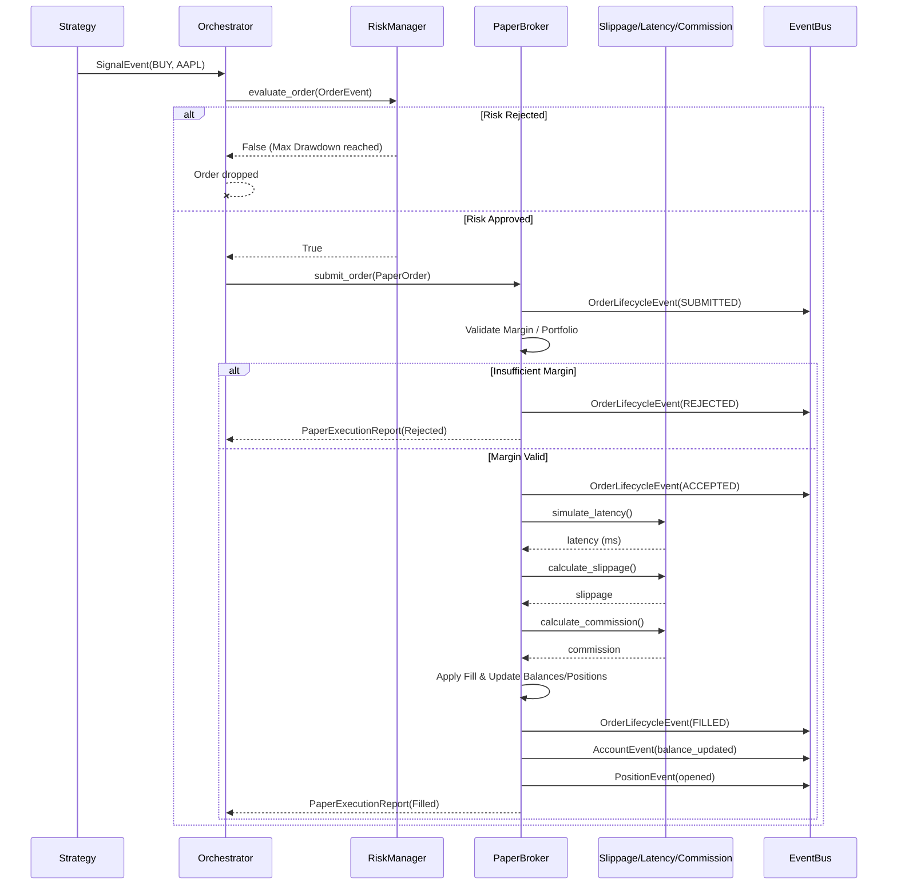
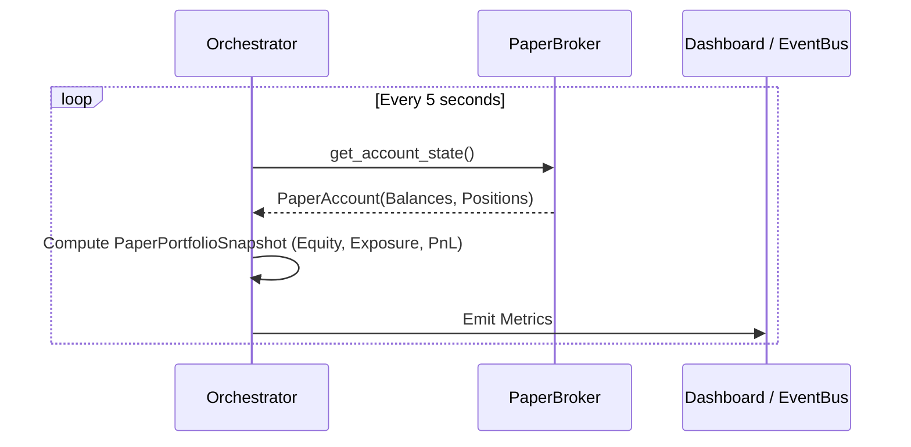

# Séquences du Paper Trading (PT-01)

## Cycle de vie complet d'un Ordre

Ce diagramme illustre comment un Signal émis par une stratégie traverse le Risk Manager, est converti en Ordre de Paper Trading, simulé via les moteurs physiques, et met à jour le Portefeuille.

## Boucle de Monitoring (Snapshots)

